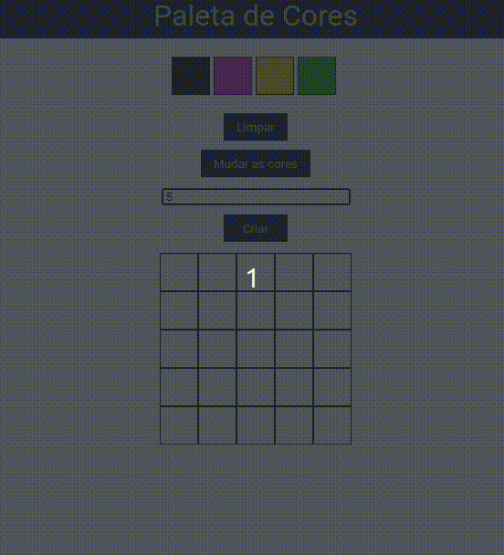

# Pixels Arts

## :black_large_square: :yellow_square: :green_square: :blue_square: :red_square: :purple_square:

## Sumário

- [Habilidades](#habilidades)
- [Desenvolvimento](#desenvolvimento)
- [Testes](#testes)
  - [Linter](#linter)
  - [Cypress](#cypress)
- [Instruções para Rodar](#instuções-para-rodar)

---

## Habilidades

- Manipular o DOM
- Manipular o Javascript
---

## Desenvolvimento

- Paleta de cores usando `javascript`, `css` e `html`.

---



---
## Testes:

### Linter

Utilizei neste projeto os linters `ESLint` e `StyleLint`.
Assim o código estará alinhado com as boas práticas de desenvolvimento, sendo mais legível
e de fácil manutenção! Para rodá-los localmente no projeto, execute os comandos abaixo:

```bash
npm run lint
npm run lint:styles
```
---

### Cypress

Para rodar o cypress localmente e verificar se seus requisitos estão passando:

```bash
npm test
```

```bash
npm run cypress:open
```

***ou***

```bash
npx cypress open
```
---
## Instruções para rodar:

1. Faça o clone do projeto e entre no diretório do projeto:
	```bash
	git clone git@github.com:jpcp0614/Project-Pixels-Art.git && cd Project-Pixels-Art
	```

2. Instale as dependências do projeto:
	```bash
	npm install
	```

3. Rode o comando abaixo para ver o projeto no seu navegador:
	```bash
	xdg-open index.html
	```
---
